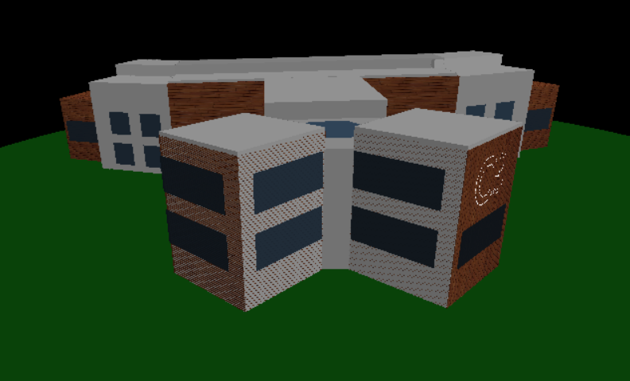
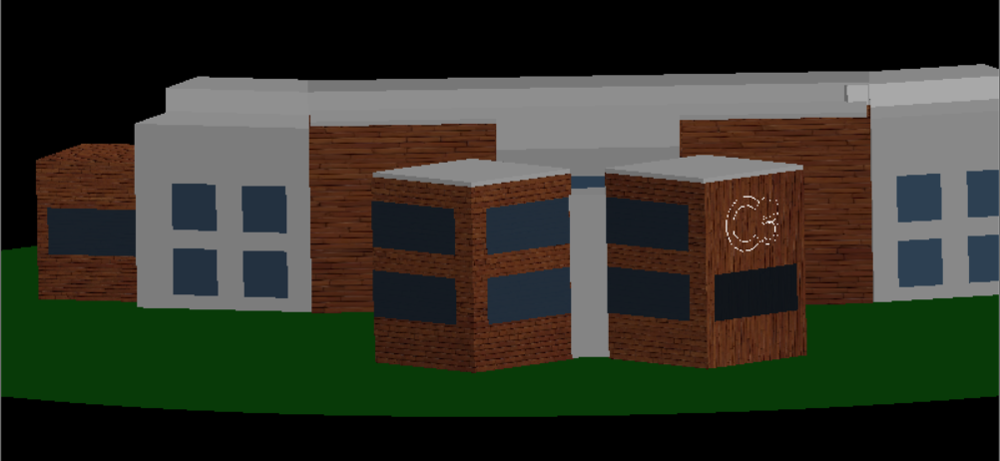

# Projeto de Modelagem Gráfica – Prédio do C3

# 📌 Descrição
Este projeto foi desenvolvido como parte da disciplina de Sistemas Gráficos FURG. Nosso objetivo foi modelar geometricamente o prédio do C3, utilizando técnicas fundamentais da computação gráfica para representar sua estrutura de forma realista e interativa.

Implementamos manualmente as principais funcionalidades gráficas com foco em transformações geométricas, projeções, iluminação, tonalização, visualização e rasterização, aplicando os conhecimentos adquiridos ao longo da disciplina.

# 🧱 Funcionalidades Implementadas
Modelagem Geométrica Completa do prédio do C3:

Paredes, janelas, portas, telhado e detalhes estruturais.

Transformações Geométricas:

Translação

Escala

Rotação (em torno de eixos arbitrários)

Projeções:

Projeção Ortográfica

Projeção Perspectiva

# Pipeline Gráfico Completo, incluindo:

Transformações de visão (camera look-at)

Transformações de projeção

Mapeamento para viewport

Algoritmos de Iluminação e Tonalização:

Modelo de iluminação de Phong

Cálculo de luz ambiente, difusa e especular

Tonalização Flat e Gouraud

Rasterização Manual:

Algoritmo de Bresenham para linhas

Preenchimento de polígonos com z-buffer

Conversão para pixels e renderização no framebuffer

# 🛠️ Tecnologias Utilizadas
Linguagem: Python

Bibliotecas de Suporte:

PyOpenGL (apenas para interface de janela e desenho de pixels)

Pygame (para controle da janela e entrada do usuário)

Algoritmos implementados manualmente, sem uso de engines gráficas prontas

# 👥 Integrantes
Allan Machado Gonçalves
Denise Velarde
João Gabriel Acosta

# 📷 Capturas de Tela

